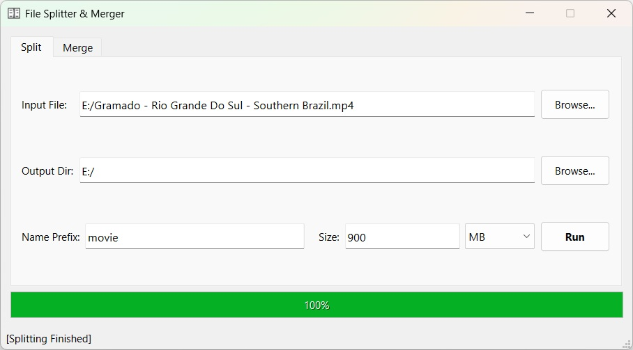
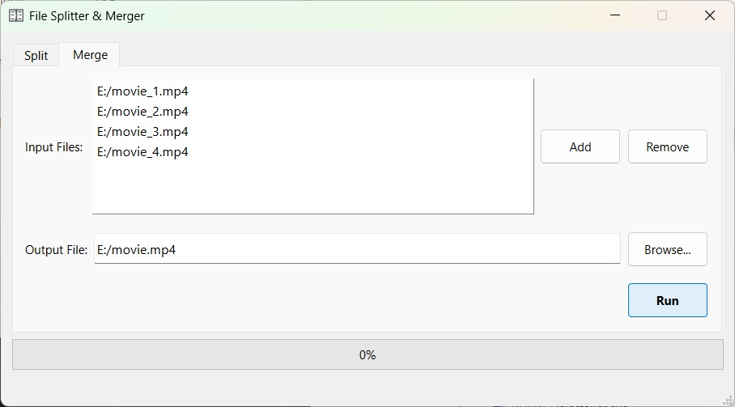

# QtLargeFileSplitMerge

This is a Qt-based application designed for splitting large files into smaller chunks and merging multiple files into one. The application provides an intuitive graphical interface for users to easily manage file splitting and merging tasks.

## Features

- **File Splitting**: Split large files into smaller chunks based on user-defined chunk sizes.
- **File Merging**: Merge multiple files into a single file in the order specified by the user.
- **Progress Tracking**: Real-time progress updates during file operations.
- **Multi-file Selection**: Supports adding multiple files for merging.
- **Customizable Output**: Allows users to specify output directory, file naming patterns, and output file paths.

## Screenshots




## Getting Started

### Prerequisites

- Qt 5.x or higher
- C++11 compatible compiler

### Installation

1. **Clone the repository**:
    ```sh
    git clone https://github.com/voidregreso/QtLargeFileSplitMerge.git
    cd QtLargeFileSplitMerge
    ```

2. **Open the project in Qt Creator**:
    - Launch Qt Creator.
    - Open the `QtLargeFileSplitMerge.pro` file.

3. **Build the project**:
    - Select the appropriate kit for your environment.
    - Build the project using the `Build` button.

4. **Run the application**:
    - Click the `Run` button in Qt Creator.

### Usage

1. **Splitting a File**:
    - Open the application.
    - Go to the `Split` tab.
    - Click `Browse...` next to the `Input File` field to select the file you want to split.
    - Click `Browse...` next to the `Output Dir` field to select the directory where the chunks will be saved.
    - Optionally, specify a name prefix and chunk size.
    - Click `Run` to start splitting the file.

2. **Merging Files**:
    - Open the application.
    - Go to the `Merge` tab.
    - Click `Add` to select the files you want to merge. The selected files will appear in the list.
    - Use `Remove` to remove any files from the list.
    - Click `Browse...` next to the `Output File` field to specify the path for the merged file.
    - Click `Run` to start merging the files.
